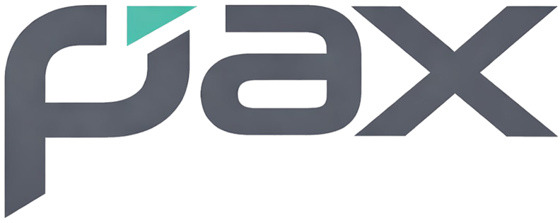

<h3 style="margin:0;padding:0;">Compiler Construction Toolkit</h3>
<h4 style="margin:0;padding:0;font-weight:normal;">From grammar to binary</h4>
 

 

## What is Pax?

**Pax** is a compiler construction toolkit written in [Delphi](https://www.embarcadero.com/products/delphi). It provides a complete infrastructure for building programming languages that compile to native binaries — end to end. You define the lexer surface, grammar rules, semantic analysis, and code emission. Pax handles the full pipeline: tokenization, parsing, AST construction, semantic validation, and C++23 IR generation — producing clean native executables via the integrated zig/clang build system.

Pax ships with **PaxLang**, a full-spec implementation of a Pascal/Oberon-inspired minimal systems programming language that dogfoods the toolkit. PaxLang's superpower is perfect C/C++ interop: C and C++ code can coexist directly in the same source file, meaning no wrappers, no bindings, and no FFI ceremony. The entire C/C++ ecosystem is available to you out of the box. The toolkit also includes a source-level debugger and AST visualization. Batteries included.

In short: Pax is to PaxLang what LLVM is to Clang — a reusable compiler infrastructure with a production language built on top of it to prove it works.

> [!IMPORTANT]
> This repository is under active development — APIs, file layouts, and language surfaces may change without notice. That said, each release aims to be stable and usable as we work toward v1.0. Follow the repo or join the [Discord](https://discord.gg/Wb6z8Wam7p) to track progress.

## 🤝 Contributing

Pax is an open project. Whether you are fixing a bug, improving documentation, adding a new showcase language, or proposing a framework feature, contributions are welcome.

- **Report bugs**: Open an issue with a minimal reproduction. The smaller the example, the faster the fix.
- **Suggest features**: Describe the use case first, then the API shape you have in mind. Features that emerge from real problems get traction fastest.
- **Submit pull requests**: Bug fixes, documentation improvements, new language examples, and well-scoped features are all welcome. Keep changes focused.

Join the [Discord](https://discord.gg/Wb6z8Wam7p) to discuss development, ask questions, and share what you are building.

## 💙 Support the Project

Pax is built in the open. If it saves you time or sparks something useful:

- ⭐ **Star the repo**: it costs nothing and helps others find the project
- 🗣️ **Spread the word**: write a post, mention it in a community you are part of
- 💬 **[Join us on Discord](https://discord.gg/Wb6z8Wam7p)**: share what you are building and help shape what comes next
- 💖 **[Become a sponsor](https://github.com/sponsors/tinyBigGAMES)**: sponsorship directly funds time spent on the toolkit, documentation, and showcase languages

## 📄 License

Parse() is licensed under the **Apache License 2.0**. See [LICENSE](https://github.com/tinyBigGAMES/PaxKit/tree/main?tab=License-1-ov-file#readme) for details.

Apache 2.0 is a permissive open source license that lets you use, modify, and distribute Parse() freely in both open source and commercial projects. You are not required to release your own source code. You can embed Parse() into a proprietary product, ship it as part of a commercial tool, or build a closed-source language on top of it without restriction.

The license includes an explicit patent grant, meaning contributors cannot later assert patent claims against you for using their contributions. Attribution is required - keep the copyright notice and license file in place - but beyond that, Parse() is yours to build with.

## 🔗 Links

- [paxkit.org](https://paxkit.org)
- [Discord](https://discord.gg/Wb6z8Wam7p)
- [Bluesky](https://bsky.app/profile/tinybiggames.com)
- [tinyBigGAMES](https://tinybiggames.com)

**Pax™** Compiler Construction Toolkit.

Copyright © 2025-present tinyBigGAMES™ LLC
All Rights Reserved.

